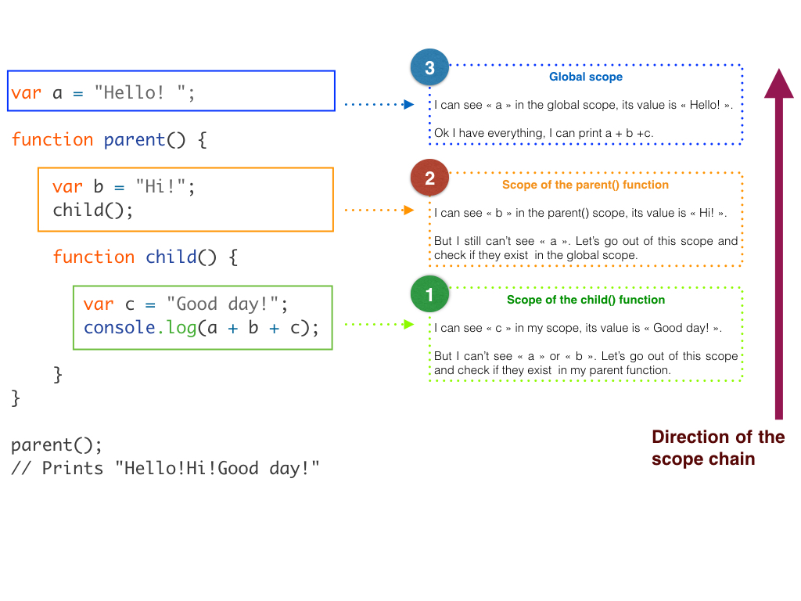

# Understanding JavaScript Variable Scope

In JavaScript, scope determines where your program can see and use certain variables. 

In other words, referring to the scope of a variable equals to answering the question : "where can we access this particular variable ?".


### Global and Local Scope

There are two kinds of scope : global and local. 

**Global** : variables defined *outside* a function are global and accessible from anywhere in your code.

**Local** : variables defined *inside* of a function are considered local to that function only. It can't be accessed or used by any of your code outside that function.


Think of the global scope as the outer space up here beyond the earth's atmosphere : it doesn't belong to any country, and everything you could find there is accessible to everyone.


Now think of a local scope as the space defined within the borders of the USA . Now it's different : everything you could find here belongs to the USA, and to the USA only. 

As someone coming from the outside, you have no right to access and claim the resources you would find within these borders.

However, as someone coming from the USA, you would still have access to everything in outer space, the global scope.


The scope of a variable in Javascript works basically the same way : 

**Variables in an inner (local) scope can't be seen or used by an outer (global) scope, but variables defined in an outer (global) scope can be seen and used by an inner (local) scope.** 


Here's an example of global and local scope :

```javaScript
var greeting = "Hi, I am a global variable"; // global scope variable

function sayHello() {
  var greeting = "Hi, I am a local variable"; // local scope variable
  console.log(greeting);
}

sayHello(); // Prints "Hi, I am a local variable"
console.log(greeting); 	// Prints "Hi, I am a global variable"

```


So what happened here ? We know that variables declared within a function are *local* variables and are only accessible within that function.

Inside of the `sayHello` function, in this local scope, `greeting` is equal to "Hi, I am a local variable".

So when we call the function `sayHello`, the value of `greeting` is the one defined in the local scope.

However, when we simply log the `greeting` variable from the **global scope**, where we are not inside of any function, the program gets the value of the variable that we defined globally : "Hi, I am a global variable".


That's very important: when we create a function, it has its own scope, its own set of variables. However, as we said before, this doesn't mean that inside of a function we can't access variables that are defined outside of the function : 


```javaScript
var greeting = "Hi there!"; // global scope

function sayHello() {
  console.log(greeting);
}

sayHello(); // Prints "Hi there !"
```


What we see here is that when we define a variable *outside* of a function, we still have access to it *inside* of that function.

Basically to wrap it up: **if we declare a variable outside a function, we can access it from inside a function, but the reverse is not true**.


### Functions Inside Functions 

But what happens if you create a function inside another function ? 


Well my friend if you do that, you are actually **creating two scopes**, and  these scopes will behave as follows : 

the child function will be able to see all the variables of all the parent functions, but the parent function will never know the variables declared inside its child function.

In other words, what is called the **scope chain** (the path that JavaScript takes when it is looking for a variable's existence and value) works in  one direction only : from the location where it is called up to the parent functions and, finally, the global scope.

So for example if we are looking for variables located in different scopes from a function that is nested inside another function, JavaScript would do this :   


I am calling the function `parent` from the global scope, which is prompted to run the `child` function, which in turn is in charge of printing the  3 values of the 3 variables declared throughout different scopes.

To determine the existence and value of each of the three variables, JavaScript starts from the inside of the `child `  function (the innermost scope being executed at the time) and goes one level up until it has either found all the variables or hit the global scope.

This scope search stops once the first match is found, which means that if all three variables `a`, `b` and `c` had been declared inside the `child` function, JavaScript would have not felt the need to work its way upward and the execution would have stopped right there in the scope of the `child` function.


### The `var`  Keyword

Consider the following code: 

```javaScript
var myVariable = "Hi, I am a global variable";

function sayHello() {
  myVariable = "Hi, I am locally produced!";
  console.log(myVariable);
}

console.log(myVariable); 	// Prints "Hi, I am a global variable"
sayHello(); 				// Prints "Hi, I am locally produced!"
console.log(myVariable);	// Prints "Hi, I am locally produced!"
```


Hey ?! How come `myVariable` 's value took the value defined locally ? The global variable was overwritten by the local variable. Why ?

Notice in this example that `myVariable` in our `sayHello()` function doesn't have the `var` keyword as a prefix: 

**If a local variable is used without being declared with the `var` keyword, it becomes a global variable.**

Following this rule, the gobal variable was reassigned a new value when the `sayHello()` function ran. As a result, `myVariable` has a different value before and after `sayHello` is run.

This also means that a variable in your local scope can have the same name as a variable in your global scope: if they are both declared with the `var` keyword, they are in fact two distinct variables, independent from one another.  By adding `var` before the variable inside the function, we create a *new* variable, that exists *only in the scope* of that function.

I know this can be a bit confusing; just remember : 

**Always declare your local variables with the `var` keyword before using them**, otherwise you will risk unfortunate behaviours of your code.


### Priority of Variables Inside Functions

If two variables with the same name are declared in the global scope and in the local scope, which one prevails ?

**The local variable will have priority over the global variable when you attempt to access the variable inside a function (local scope).**


Let's demonstrate this : 

```javaScript
var myJob = "Developer";

function showJob() {
  var myJob = "Designer";
  console.log(myJob);
}

showJob(); // Prints "Designer"
```


The `myJob` variable is declared in the global scope and in the local scope of the function that is prompted to log it in the console. JavaScript's search for `myJob` starts right inside the function and finds it, so it stops without attempting to look in the outer scope.

Since `myJob` inside the function is local, it prevails over the variable with the same name in the global scope.


### The lexical scope

Maybe you are wondering if the scope of a variable inside a function will change depending on where the function is called inside your program : if I run my function before or after declaring it, will the variable in its scope have a different value ?

The answer is no, because **functions in JavaScript are *lexically scoped*** : they run in the scope in which they are defined, not the scope from which they are executed.

It is the static structure of a program, the location of the functions and variables  written by the author of the code,  that determines the scope of a variable :

Let's consider this block of code : 

```javaScript
var myVariable = "global";
printVariable(); // Prints "local"

function printVariable() {
  var myVariable = "local";
  console.log(myVariable);
}

printVariable(); // Prints "local"
```


The value of `myVariable` is in both cases the value of the variable declared *inside* the function : it is truly **independent of where the function is *run* and only depends of the local scope where it is *declared***.


### **Conclusion : How to Use the Scope ?**


Using the local scope of functions helps prevent accidental interference between functions. For example, it saves the time-consuming effort of making sure no name is ever used for two different purposes inside the same programs.

By creating a local scope every time a new function is written, JavaScript makes it possible to consider each function as a self-enclosed universe of its own, and a way to keep the global scope clean.


---------------
*Léna Faure - 11/18/2016 - Career Path 3: Modern Front-End Developer*

