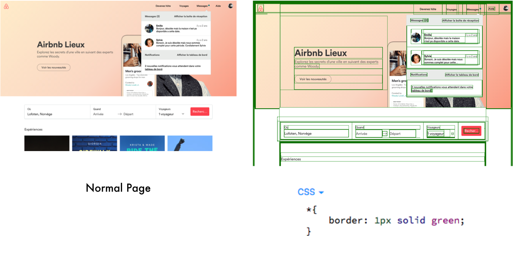
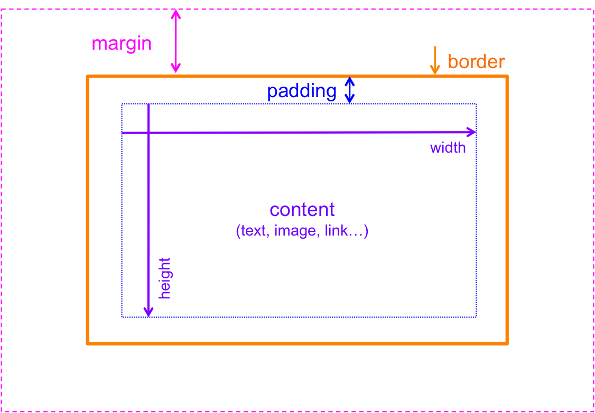
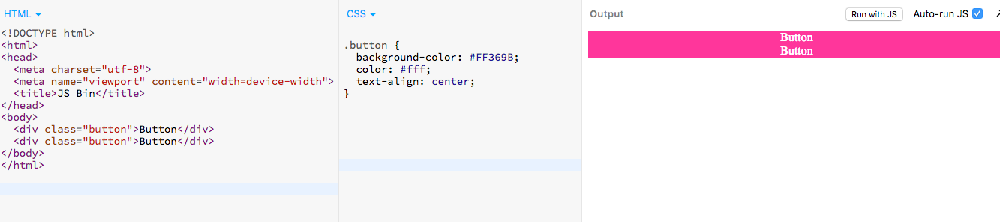
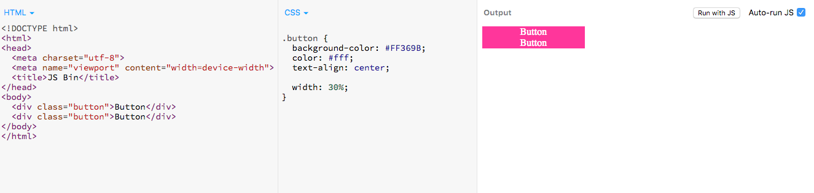
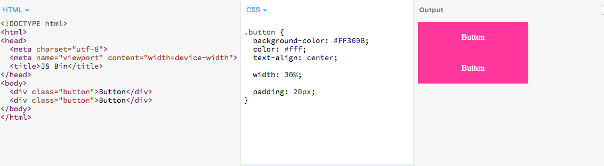
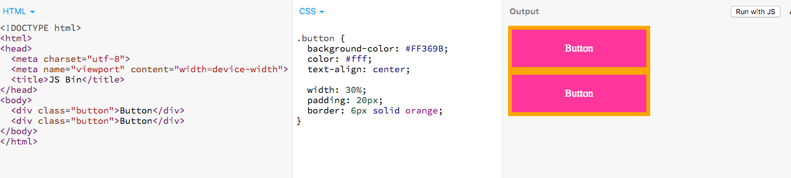
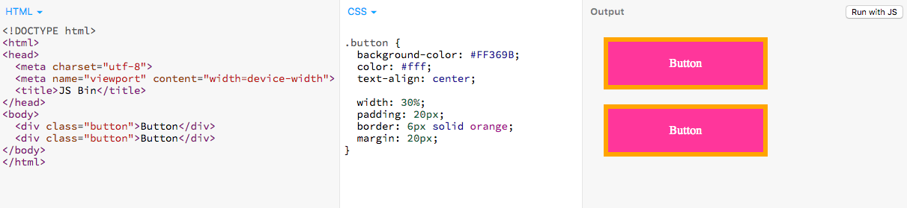

# The CSS Box Model

The Box Model in CSS can be described by this basic fact that is really central to everything in HTML and CSS: **every element in your web page is a rectangular box, wether or not it looks like a box to the user**.

If I take any web page and place a border around every element, I can see that everything is a rectangular box: 

Everything in the layout of a web page is related to this box model and the fact that **every element has a rectangular box around it**.

There are four different parts on every box that we can manipulate: 

- Content 
- Padding
- Border
- Margin

Let's start from the inside and work our way to the outside of the box.

#### 1. The content area

First we have the **content** area. This is the actual text or image inside an HTML element. If I want to design two buttons for example, I will start by writing the content of the button and maybe give it a background-color: 

What I get is two divs taking the whole width of the page (the natural behaviour of the `div` , since it is a block element) and glued to each other. I can add a width and a height to the element to make it look more like a button. And when I do, I apply the **width and height only to the content of the box**. 

Let's give them a width of 30% of the parent container, which is the `body`:

That's better in terms of size of the element, but still not a perfect button. We can move on to the **padding** property to see how it can help.

#### 2. The padding

**Padding** is the space between the content and the border of the box, and it allows us to let the content "breathe" more inside of the box. It represents the inner margin of a CSS box - the layer between the outer edge of the content box and the inner edge of the border.

Ok, now we have something that begins to look more like buttons. I added a padding of 20px to the 4 sides of the elements with the padding shorthand property (I could also have done it or one side at a time with the `padding-top`, `padding-right`, `padding-bottom` and `padding-left` properties).

But we still cannot differentiate the two buttons though, and we need to separate them from one another. Let's take a look at the **border** property now.

#### 3. The border

The **border** outlines the *visible* portion of the element. It is a distinct layer, sitting between the outer edge of the padding and the inner edge of the margin

By default the border has a size of 0 (invisible) but you can set the thickness, style and color of the border to make it appear, either with the shortand proprty that I used, or with one of its longhand properties for your more specifics styling needs.

I added a 6px orange border on every side of my button. Now I can differentiate the two and clearly see that we have two element, two boxes. 

What if I want them to be really separate from one another, to have a space between them? That is what the **margin** will help us do.

#### 4. The margin

The **margin** is the transparent area around the box that separates the box from other elements in the page. It has no background color and will not obstruct elements behind it.

Margin allows us to add spacing between elements. So now we have some true buttons: I added a margin of 20px all around each element using the shorthand property (individual properties of margin behaves rather like padding individual properties in case you need more specific design tools). 

#### Good to know 

When you set the width and height properties of an element with CSS, you just set the width and height of the **content area**. To calculate the full size of an element, you must add padding, borders and margins:

> **Total element width** = width + left padding + right padding + left border + right border + left margin + right margin 
>
> **Total element height** = height + top padding + bottom padding + top border + bottom border + top margin + bottom margin

---------------
*Léna Faure - 12/01/2016 - Career Path 3: Modern Front-End Developer*
