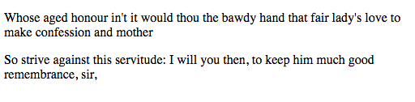

## The `p` tag in HTML

The `<p>` tag defines a paragraph of text in an HTML page: use it when you need to define a block of text as a paragraph. It is a **block** element, meaning that it occupies the entire space of its parent element .

A typical `<p>` element generally looks like this :

```html
<p>Whose aged honour in't it would thou the bawdy hand that fair lady's love to make confession and mother</p>
<p>So strive against this servitude: I will you then, to keep him much good remembrance, sir,</p>

```

And will render this :



As you can see, browsers automatically add some space (margin) before and after each `<p>` element, and the default values are : 

```css
p {
    display: block;
    margin-top: 1em;
    margin-bottom: 1em;
    margin-left: 0;
    margin-right: 0;
}
```

---------------
*Léna Faure - 12/01/2016 - Career Path 3: Modern Front-End Developer*
